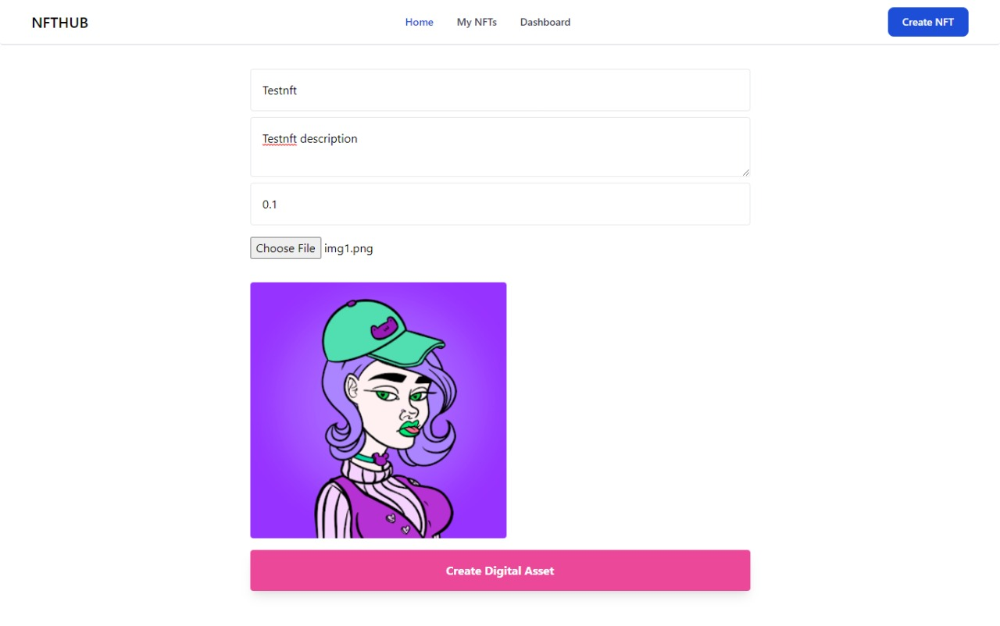

<h1 align="center">NFT Hub</h1>

<h3 align="center">Create, sell and buy NFTs</h3>


<a href="https://nft-hub-rho.vercel.app/"><h3 align="center">Visit Deployment</h3></a>

## What is NFT-Hub

NFT-Hub is a peer-to-peer NFT marketplace where you can manage, discover and explore rare digital collectibles. It is a decentralized application with additional features to easily manage your NFTs. 

The web application allows you to create an NFT through a file upload, as well as through our AI model for generating random 1280x1280 images consisting a grid pattern.

### Sample NFT Image generated


Finally you can upload your own created NFT to the distributed network.



## Running the Image Generation Server Locally

### Using docker
- Pull the docker image
  ```
  docker pull bhworld/nft_hub:2.04
  ```
- Run the docker image
  ```
  docker run --publish 5000:5000 bhworld/nft_hub:2.04
  ```
- Check the service at the IP address printed

### Using GitHub repository
- Clone this repository or download the zip file
  ```
  git clone https://github.com/Sanket-Mathur/NFT-Hub.git
  ```
- Change directory to the image_generation directory
  ```
  cd NFT-Hub/image_generation/
  ```
- Serve the api
  ```
  python api.py
  ```
- Check the service at the IP address printed

## Running Blockchain Client server locally

- Clone this repository or download the zip file
  ```
  git clone https://github.com/Sanket-Mathur/NFT-Hub.git
  ```
- Change directory to the image_generation directory
  ```
  cd NFT-Hub/blockchain_app/
  ```
- Install npm packages
  ```
  npm install
  ```
- HardHat Setup
  ```
  npx hardhat node
  ```
- In a new terminal client and execute
  ```
  npx hardhat run scripts/deploy.js --network localhost
  ```
- Edit the config.js file (The required address are extracted in previous step)
  ```
  export const nftaddress = 'address_of_deployed contract NFT.sol'
  export const nftmarketaddress = 'address_of_deployed contract NFTMarket.sol'
  ```
- Run Next.js app
  ```
  npm run dev
  ```